# 虛幻競技場 99 — 重製版

以 C# / .NET 10 從零打造的競技場第一人稱射擊遊戲，向 1999 年的《Unreal Tournament》致敬。
**全部介面文字皆為繁體中文**，支援**最多四人同機分割畫面**，並可讓前三位玩家各自使用一個
實體滑鼠與一組獨立按鍵配置。
繪圖採用自製的 OpenGL 3.3 前向 PBR 管線。

除 ImageGen 設計的品牌標誌外，遊戲內容皆由程式產生：沒有外部模型、關卡或音效檔案。所有材質、
網格、角色、動畫、競技場與音效都在啟動時以程序化方式即時產生。

---

## 執行

```bash
dotnet run --project src/Unreal99/Unreal99.csproj -c Release
```

遊戲預設以**全螢幕、桌面原生解析度**啟動。

需求：.NET 10 SDK、支援 OpenGL 3.3 的顯示卡，以及系統已安裝中日韓字型
（優先使用微軟正黑體 `msjh.ttc`，另有 `mingliu.ttc`、`msyh.ttc`、`simsun.ttc` 作為備援）。

### 圖形化安裝程式

建立可散發的安裝套件：

```powershell
.\build-installer.ps1
```

然後開啟 `artifacts\installer\Unreal99Installer.exe`。安裝程式可選擇其他安裝位置、建立目前使用者的
開始選單捷徑、更新現有安裝，並可安全移除由它加入的檔案；全程不需要系統管理員權限。安裝程式
與遊戲皆使用 Windows GUI 子系統，從開始選單或檔案總管開啟時不會附帶終端視窗。

### 命令列安裝

```powershell
# 預設安裝並建立開始選單捷徑
artifacts\installer\Unreal99Installer.exe install

# 指定安裝位置，且不建立捷徑
artifacts\installer\Unreal99Installer.exe install --install-dir "D:\Games\Unreal99" --no-start-menu

# 移除指定位置的安裝
artifacts\installer\Unreal99Installer.exe uninstall --install-dir "D:\Games\Unreal99"

# 顯示所有選項
artifacts\installer\Unreal99Installer.exe --help
```

命令列與圖形介面使用相同的複製、驗證、安裝紀錄與捷徑邏輯。`--source <路徑>` 可讓自訂打包流程
指定包含 `Unreal99.exe` 的 payload 目錄。

### 1.0.1 發行下載

[GitHub Release v1.0.1](https://github.com/blhsing/unreal99/releases/tag/v1.0.1) 提供兩種 Windows x64
下載與 SHA-256 校驗檔：

- `Unreal99-1.0.1-Setup-win-x64.zip`：圖形化／命令列安裝程式及其 1.0.1 payload。
- `Unreal99-1.0.1-win-x64.zip`：免安裝的可攜式遊戲文件。
- `SHA256SUMS.txt`：上述兩個 ZIP 的完整性校驗值。

執行 `build-installer.ps1` 會在 `artifacts/release/` 同步重建這三個發行文件。遊戲視窗標題以及載入、
選單、對戰與結果畫面會持續顯示「版本 1.0.1」，因此全螢幕中也能確認目前執行的版本。

### 命令列參數

| 參數 | 說明 |
| --- | --- |
| `--windowed` | 以視窗模式啟動（開發與截圖用） |
| `--startmatch` | 略過選單直接進入戰鬥 |
| `--demo` | 展示模式：本機玩家改由電腦操控，但仍保留各自的畫面與 HUD |
| `--players N` | 同機玩家人數，1～4 |
| `--split horizontal|vertical` | 雙人分割方向：上下或左右 |
| `--bots N` | 電腦對手數量，0～15 |
| `--skill N` | 電腦難度，0（新手）～5（神級） |
| `--demoskill N` | 示範模式代打難度，0（新手）～5（神級），與對手難度分開 |
| `--map N` | 競技場編號 0～24，見下方〈競技場〉 |
| `--mode N` | 0 死亡競賽、1 團隊死亡競賽、2 奪旗大戰、3 最後生還者、4 瞬殺模式、5 支配佔領、6 攻堅模式、7 突擊模式 |
| `--frags N` / `--time N` | 擊殺上限／時間上限（分鐘） |
| `--captures N` / `--domination N` | 奪旗上限／支配佔領得分上限；`0` 表示無限制 |
| `--respawn N` | 重生等待時間，0～9 秒；預設 3 秒，`0` 表示立即重生 |
| `--quality N` | 0 低、1 中、2 高、3 史詩 |
| `--debug` | 顯示效能資訊 |
| `--menuscreen 名稱` | 直接開啟 `Main`、`Setup`、`MapGallery`、`Video`、`Controls`、`Devices`、`Bindings` |
| `--autoshot N 路徑` | 執行 N 個畫格後輸出 PNG 截圖並結束 |
| `--traversaltest N 路徑` | 執行固定步長的電腦走圖測試，輸出遙測與 PNG；不擷取或移動桌面游標 |
| `--inputtest` | 多裝置輸入自我測試 |
| `--bindingtest` | 玩家三預設按鍵與舊設定遷移的無視窗自我測試 |
| `--menutest X Y` / `--menuclick` | 將系統游標移到指定座標並可注入點擊，用於自動驗證選單滑鼠操作 |
| `--flyby` | 讓玩家一的鏡頭在場中環繞巡航，用於檢視競技場全貌 |
| `--nohud` | 隱藏介面與第一人稱槍枝，用於擷取文件用畫面 |
| `--weaponshot N` | 強制裝備第 N 把武器，只隱藏 HUD 而保留第一人稱武器，用於擷取武器指南 |
| `--weaponfootage N primary|secondary|both 路徑` | 在哥德庭園的實戰場景輸出第 N 把武器的 30 格動態畫面 |
| `--weaponturntable N 路徑` | 以玩家接近拾取物的俯視角度，輸出第 N 把武器的 36 格 360° 旋轉畫面 |
| `--loadslot N` | 直接從第 N 個存檔位接續對戰 |
| `--weapon N` | 強制玩家一持有指定武器，用於檢視第一人稱模型 |
| `--savetest` | 存檔與設定的往返自我測試（寫入、讀回、還原到實際世界並比對） |
| `--flycam 半徑 高度 角度 注視高度` | 手動指定巡航鏡頭的取景，用於為個別競技場擷取滿意的角度 |
| `--install-shortcut` / `--uninstall-shortcut` | 建立／移除開始選單捷徑 |

---

## 競技場

二十五座競技場，**每一座都是向原作經典地圖的致敬之作**（前二十一座來自 1999 年的初代，
另外四座取自 UT2004 引進的攻堅與突擊模式）。佈局、路線、上下樓的方式與
每張圖的武器道具清單都**逐一對照過原作資料**（來源見
[docs/original-map-reference.md](docs/original-map-reference.md)），幾何、材質與模型則完全用
`LevelBuilder` 重新打造，沒有反編譯、轉檔或沿用任何原作關卡資料。

憑印象重建是不夠的：對峙世界原本蓋成中空塔樓配螺旋坡道，實際上塔樓是實心的、各層靠傳送器
連接；莫比亞斯原本是一層平面圓廳，實際上是兩層八角巨蛋；火衛基地被當成低重力圖，原作明言
重力正常。這些都是查了才發現的。

以下皆為遊戲內即時擷取的畫面（`--nohud`，無介面與槍枝）：

<table>
<tr>
<td width="33%"><br><b>0 · DM-莫比亞斯</b><br><i>Morbias ][</i></td>
<td width="33%"><br><b>1 · DM-磚牆競技場</b><br><i>Stalwart</i></td>
<td width="33%"><br><b>2 · DM-詛咒之庭</b><br><i>Curse ][</i></td>
</tr>
<tr>
<td><br><b>3 · DM-絞碎機</b><br><i>Grinder</i></td>
<td><br><b>4 · DM-古籍密室</b><br><i>Codex</i></td>
<td><br><b>5 · DM-哥德庭園</b><br><i>Gothic</i></td>
</tr>
<tr>
<td><br><b>6 · DM-十六號甲板</b><br><i>Deck16 ][</i></td>
<td><br><b>7 · DM-渦輪機房</b><br><i>Turbine</i></td>
<td><br><b>8 · DM-火衛基地</b><br><i>Phobos</i></td>
</tr>
<tr>
<td><br><b>9 · DM-孤峰</b><br><i>Peak</i></td>
<td><br><b>10 · DM-利安德里核心</b><br><i>Liandri Central Core</i></td>
<td><br><b>11 · DM-摩菲斯之塔</b><br><i>Morpheus</i></td>
</tr>
<tr>
<td><br><b>12 · DM-超載星艦</b><br><i>HyperBlast</i></td>
<td><br><b>13 · CTF-科瑞特設施</b><br><i>Coret Facility</i></td>
<td><br><b>14 · CTF-十一月號</b><br><i>November</i></td>
</tr>
<tr>
<td><br><b>15 · CTF-對峙世界</b><br><i>Facing Worlds</i></td>
<td><br><b>16 · CTF-熔岩巨人</b><br><i>Lava Giant</i></td>
<td>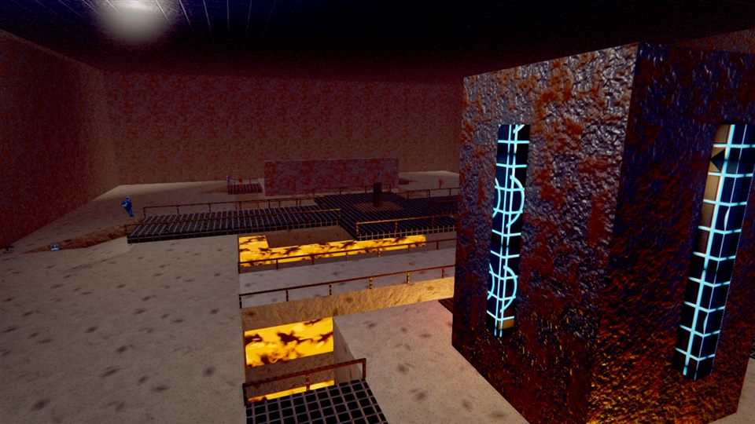<br><b>17 · DOM-熔鉛廠</b><br><i>Leadworks</i></td>
</tr>
<tr>
<td>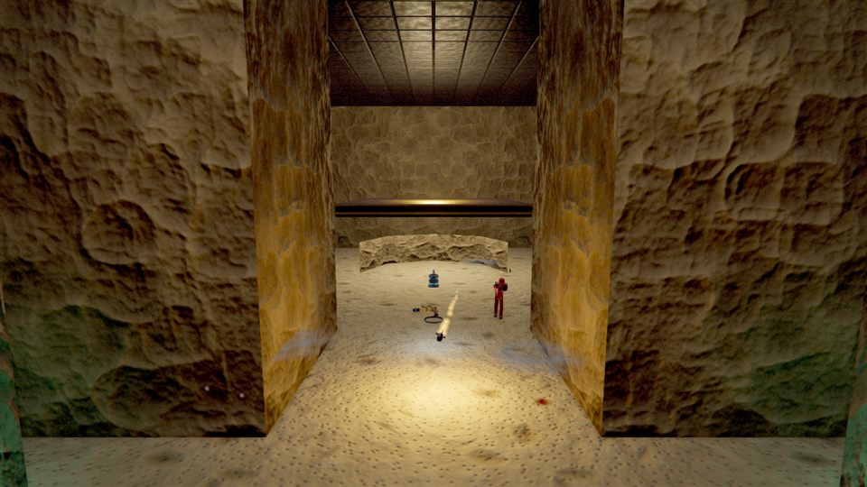<br><b>18 · DOM-賽斯瑪之墓</b><br><i>Sesmar</i></td>
<td>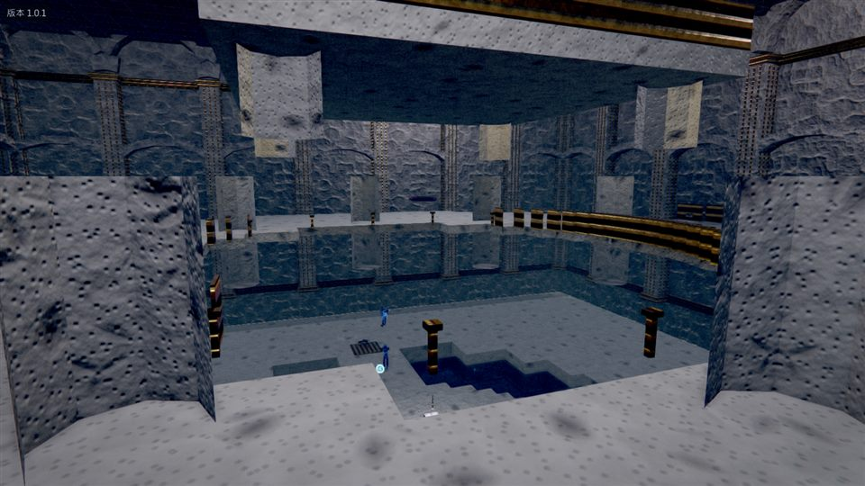<br><b>19 · DOM-奧登含水層</b><br><i>Olden</i></td>
<td>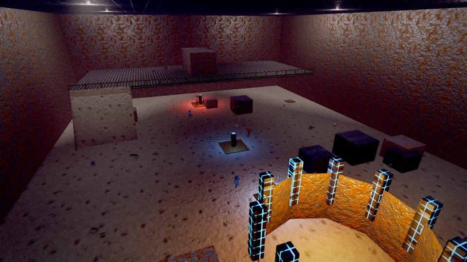<br><b>20 · DOM-灰燼鑄造廠</b><br><i>Cinder</i></td>
<td>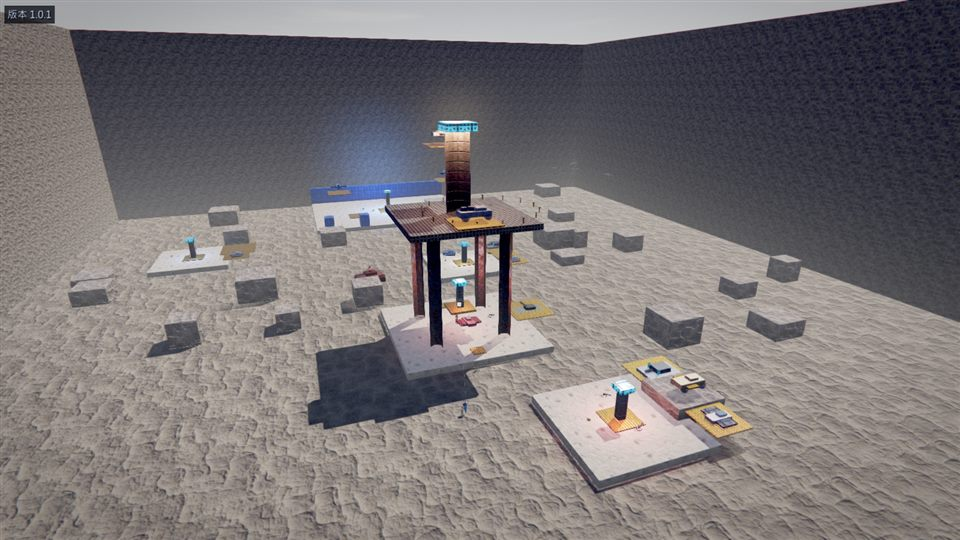<br><b>21 · ONS-托蘭</b><br><i>ONS-Torlan</i></td>
</tr>
<tr>
<td>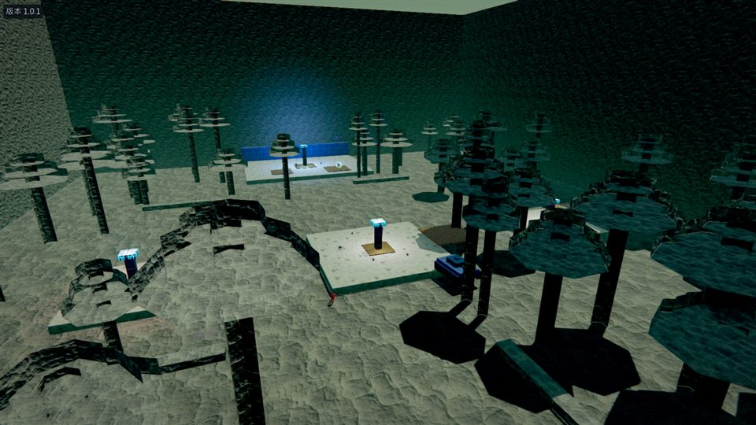<br><b>22 · ONS-原始林</b><br><i>ONS-Primeval</i></td>
<td>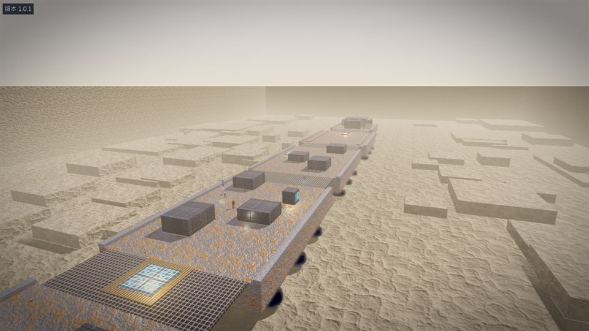<br><b>23 · AS-車隊</b><br><i>AS-Convoy</i></td>
<td>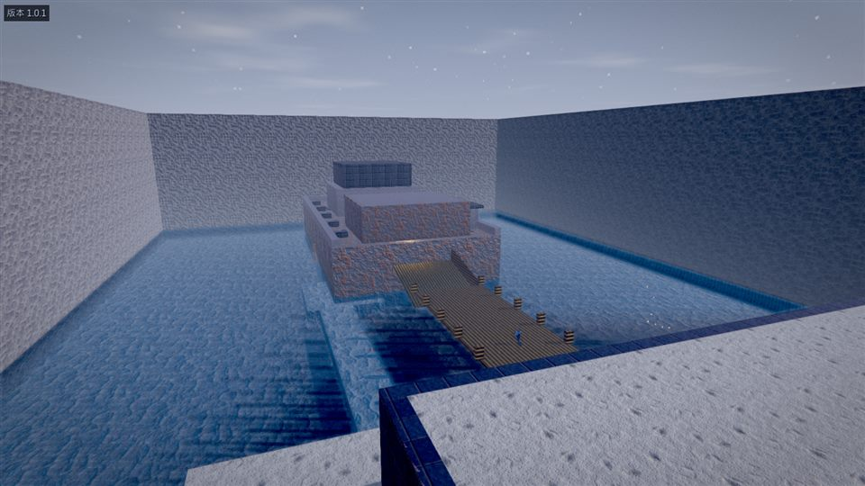<br><b>24 · AS-護衛艦</b><br><i>AS-Frigate</i></td>
</tr>
</table>

統治模式的四張圖以 `--mode 5` 擷取，控制點因此顯示所屬隊伍的顏色；用死亡競賽拍 DOM 圖，
所有控制點都會是中立灰，等於沒拍到重點。攻堅與突擊的四張圖同理，分別以 `--mode 6`／`--mode 7`
擷取——能量節點、目標標記與全部載具都只在自己的模式裡存在。擷取流程與各圖的鏡頭參數見
[docs/capture-arenas.ps1](docs/capture-arenas.ps1)。

下表的編號即 `--map` 參數要傳入的值：

| 編號 | 名稱 | 致敬對象 | 特色 |
| --- | --- | --- | --- |
| 0 | DM-莫比亞斯 | *Morbias ][* | 八角雙層巨蛋，南北升降梯是唯一上下通道；全圖只有四把火箭與一具救世主 |
| 1 | DM-磚牆競技場 | *Stalwart* | 紅磚大廳、看台走道與兩側側室 |
| 2 | DM-詛咒之庭 | *Curse ][* | 緊湊的石室與地下通道 |
| 3 | DM-絞碎機 | *Grinder* | 環形走道包圍中央深坑，橫越坑口的窄梁上放著護盾帶 |
| 4 | DM-古籍密室 | *Codex* | 環形迴廊包夾中央豎井，書牆環繞 |
| 5 | DM-哥德庭園 | *Gothic* | 紫夜、列柱、火盆與發光祭壇 |
| 6 | DM-十六號甲板 | *Deck16 ][* | 熔岩渠道貫穿全場，震盪步槍架在中央長橋上 |
| 7 | DM-渦輪機房 | *Turbine* | 工業廠房，圍繞巨型渦輪的環廊 |
| 8 | DM-火衛基地 | *Phobos* | 火衛星表面基地，中央大洞環繞走廊；重力正常，靠反重力靴上樓 |
| 9 | DM-孤峰 | *Peak* | 雲海之上的山巔遺跡，中央神殿高台與四座角落露台 |
| 10 | DM-利安德里核心 | *Liandri Central Core* | 發光核心豎井，四層錯開的迴廊向上盤旋，頂端是救世主 |
| 11 | DM-摩菲斯之塔 | *Morpheus* | 三棟摩天樓頂，**低重力**，跳台互連，屋簷下另有一圈外伸平台 |
| 12 | DM-超載星艦 | *HyperBlast* | 對稱星艦內艙，上層天橋貫穿全船 |
| 13 | CTF-科瑞特設施 | *Coret Facility* | 上下兩條路線從基地直通中央大廳 |
| 14 | CTF-十一月號 | *November* | 潛艦碼頭，中央水道的潛艦艦身是最高的爭奪點 |
| 15 | CTF-對峙世界 | *Facing Worlds* | 兩座塔樓各開三個面向場中的洞口，傳送器連接各層，中央一無所有 |
| 16 | CTF-熔岩巨人 | *Lava Giant* | 熔岩海中的紅藍雙堡，中央山脊是必爭之地 |
| 17 | DOM-熔鉛廠 | *Leadworks* | 三座熔融金屬池分隔全場；控制點為 Tower、Bridge、Storage |
| 18 | DOM-賽斯瑪之墓 | *Sesmar* | 埃及陵墓三墓室；六把火箭四把機槍的誇張配置 |
| 19 | DOM-奧登含水層 | *Olden* | 山中神殿，中央泉眼島與環形護城河，四條堤道相通 |
| 20 | DOM-灰燼鑄造廠 | *Cinder* | 停工鑄造廠；熔爐、澆鑄通道與吊車各鎮守一點 |
| 21 | ONS-托蘭 | *ONS-Torlan* | 攻堅模式代表作；五個節點連成一線，中央通訊塔俯瞰全場，乾河床是穿越中路的主路線 |
| 22 | ONS-原始林 | *ONS-Primeval* | 昏暗森林小圖，只有三個節點；中央空地是全圖唯一的重裝甲 |
| 23 | AS-車隊 | *AS-Convoy* | 沙漠中的六節運輸車隊，攻方從尾車一路推進到前方的 Nexus 飛彈；七個目標 |
| 24 | AS-護衛艦 | *AS-Frigate* | 停泊中的軍艦 SS Victory；木橋與水下通道兩條登艦路線，兩個目標 |

低重力關卡由 `Level.GravityScale` 控制；角色重力、投射物重力、跳台的彈道解算與電腦對手的
投射物提前量都會據此調整。這個係數不能無限調低：重力愈輕，跳躍愈高、滯空愈久，欄杆就愈擋不住人。
摩菲斯之塔原本設為 0.42，站立跳躍可達 3.3 公尺，任何看得見城市的欄杆都形同虛設，整場比賽變成
比誰摔得少；現在是 0.60，跳躍高度 2.2 公尺，欄杆才真的擋得住。塔與塔之間改由跳台連接。

導航圖在關卡建好後由碰撞世界自動生成，只會連接高度差在一個台階以內的相鄰節點。因此凡是超過
約 1:3 的坡道，電腦對手都無法沿著它上樓——每一處高低落差都必須另外配上跳台、升降梯或傳送門，
否則整層樓對電腦而言等於不存在。

---

## 支配佔領

依原作規則實作：**進入控制點即完成佔領**，沒有讀條、不需要持續站立，也不需要清場；只有離開後
再進入才算下一次觸碰，兩隊同時留在點內不會每個畫格反覆易主。新佔領的點有原作的兩秒啟用期，
之後每秒跳加 0.2 分，也就是正常速率下**每持有一個控制點，每五秒顯示增加一分**。持有兩點的
得分速度正好是一點的兩倍；有時間上限時，最後四分之一加快為兩倍，最後十分之一為四倍。先達可在
選單或 `--domination` 設定的得分上限（預設 100），或時間結束時分數最高的隊伍獲勝。時間到而
顯示分數相同時，依原作先比較當下持有的控制點數，仍相同則和局。原作的 DOM 地圖一律是三個控制點，
本作四張也都是三個。

HUD 下方會以繁體中文列出每個控制點的名稱與目前歸屬（例如熔鉛廠原作的 Tower、Bridge、Storage
顯示為「高塔」、「橋樑」、「儲藏庫」），剛易主的點會閃動；控制點本身在場中以所屬隊伍的顏色
發光，跨房間也看得出歸屬。

### 電腦對手的戰術

電腦對手不是在控制點附近打死亡競賽，而是真的會去搶點：

* 己方未持有的點才是進攻目標；隊內依穩定編號把進攻者分配到不同目標，避免整隊擠向同一點。
* 只有執法者或遠距武器沒彈藥時會先繞往可達的武器／彈藥，最多嘗試兩次，再回到佔點任務。
* **只有在領先且持有兩點以上時才會分出人手防守**；落後或平手時全隊進攻——守著劣勢只是輸得慢一點。
* 進攻者把控制點當作目標點位（objective）承諾路線；防守者在所分配控制點周圍的可走節點巡邏，
  不會站在標記中央不動，也不會讓攝影機鑽進控制點模型。

### 控制點必須放在走得到的地方

四張圖在測試中反覆出現同一個問題：**放在高處、只能靠跳台上去的控制點，整場比賽都不會有人佔領**。
熔鉛廠的 Tower 先放在 5.5 公尺、再改 2.5 公尺，兩次都整場中立；奧登含水層的迴廊與神殿、
灰燼鑄造廠的吊車也一樣。原因是導航圖不會為「只有跳台可達」的位置承諾路線，而勉強跳上去的
電腦對手落地時還會摔死。最後全部改放在地面高度或緩坡可達之處，上方結構保留為射擊位——
高處值得佔，但不該是非站不可的那個點。

競技場圖庫中的每張卡片直接使用上方 README 的實機截圖，並附有專屬介紹；滑鼠移過或以鍵盤反白
即可查看。

---

## 攻堅模式

UT2004 引進的模式，本作依原作規則實作。全場是一張**能量節點連線圖**，兩端各有一座核心：

* **連線規則就是這個模式的全部**。一個節點只有在**至少一條連線通往我方已啟用的節點**時才能
  建造或攻擊；核心只有在敵方持有與它直接相連的節點時才會暴露。因此戰線只能一節一節推進，
  無法直接衝向對方核心——沒有這條規則，攻堅模式就只是多幾個點的支配佔領。
* 站在中立節點上會逐步建造（約六秒），站在敵方節點上則是先拆到中立才能重建，不能直接覆寫。
* 節點與核心也吃**武器與載具的傷害**，且不限距離。用 Goliath 或自走砲從防守圈外轟掉一個節點，
  是原作最有效的破線手段，本作照樣成立（但一樣受連線規則限制，砲兵無法越級打擊）。
* 摧毀敵方核心即獲勝：常規時間內得 2 分，延長賽（驟死）得 1 分。

HUD 下方以卡片列出整條節點鏈：所屬隊伍、建造進度或剩餘耐久，**目前可攻擊的節點以金色外框標示**
——那圈外框就是這個模式的戰略資訊。最上方一行則直接告知核心狀態（受保護／我方暴露／敵方暴露）。

### 電腦對手的戰術

* 目標一律由連線規則產生，**不會跑去站在打不到的敵方核心前面**。
* 我方核心一旦暴露，全隊立刻回防；否則約三分之一的隊員負責防守「敵方目前打得到的」我方節點。
* 防守者在節點周圍巡邏而不站在正中央，既不擋住佔領區也不當靶。
* 距離超過 34 公尺才值得先去開載具，且該載具必須真的縮短行程，否則只是繞路。

---

## 突擊模式

一隊進攻、一隊防守，攻方必須**依固定順序**完成一連串目標：

* 目標有三種——**破壞**（射到壞，例如液壓壓縮機、武器艙面板）、**佔位**（持續站在圈內，例如安置
  炸藥），以及**抵達**（走到就算，例如跳進飛彈拖車）。
* **同一時間只有一個目標是活的**。射擊隊列中下一個發電機不會有任何效果，這是原作的規則，也是
  防守方能集中火力的原因。
* 攻方每完成一個目標，**重生點就往前推一組**；沒有這個機制，長圖的最後一個目標打不下來。
* 佔位型目標只要圈內有防守者就會停住進度（不會倒退）——那個貼身爭奪就是這個模式的重頭戲。
* 第一回合結束後**攻守交換**，並以第一回合的完成時間為目標；第二回合更快才算贏，追平不算。
  若雙方都沒打完，比完成的目標數，仍相同則和局。
* 這個模式一定有回合時限：設成「無限制」時會自動採用原作的六分鐘。沒有時鐘，攻方卡住時第一
  回合就永遠不會結束，攻守也就永遠不會交換。

HUD 中央的目標卡顯示目前目標名稱、回合、自己是進攻或防守、進度條與（第二回合的）目標時間。

### 電腦對手的戰術

* 攻方全員集中在**當下那一個**目標；防守方則在目標周圍巡邏，只有在佔位型目標已經開始讀進度時
  才會踏進圈內卡住它。
* 沒有敵人在視野內時，攻方會主動**朝破壞型目標開火**——一般戰鬥程式碼只認得會動的敵人，不加這段
  的話電腦會一路走到發電機前面然後站著欣賞它。開火前會先確認彈道沒被擋住。
* 破壞型目標的停止距離是 `半徑 + 6` 公尺（至少 10 公尺）。距離太近時火箭的爆風會打到自己——
  而在原本的實作中，自傷會讓電腦把**自己**設成攻擊目標，於是低頭盯著自己的腳好幾秒。
  兩個問題都已修正（自傷不再改變目標）。

---

## 載具

UT2004 與 UT3 引進的**十七種載具全部實作**，**且只在攻堅與突擊模式中出現**——同一張圖用死亡
競賽載入時不會生成任何載具。按 `F`（玩家一）上下車；多人座載具的乘客座位各自獨立瞄準與開火。

| 系列 | 載具 | 運動方式 | 座位 | 特徵 |
| --- | --- | --- | --- | --- |
| Axon | Scorpion | 輪型 | 1 | 快速偵察車 |
| Axon | Hellbender | 輪型 | 3 | **駕駛無武裝**，火力全在後兩座 |
| Axon | Goliath | 輪型 | 2 | 主戰車，主砲＋車頂機槍 |
| Axon | Leviathan | 輪型 | 5 | 移動堡壘；架設後開火離子砲 |
| Axon | Paladin | 輪型 | 1 | 可展開能量護盾吸收傷害 |
| Axon | SPMA | 輪型 | 2 | 自走砲，需架設 |
| Axon | Manta | 氣墊 | 1 | 雙電漿砲，可俯衝輾壓 |
| Axon | Raptor | 飛行 | 1 | 戰機 |
| Axon | Cicada | 飛行 | 2 | 武裝直升機 |
| — | Ion Tank | 輪型 | 1 | 離子戰車（原作僅 AS-Glacier） |
| Necris | Viper | 氣墊 | 1 | 可**自爆** |
| Necris | Scavenger | 步行 | 1 | 三足快速單位 |
| Necris | Nemesis | 輪型 | 1 | 低車身砲塔 |
| Necris | Nightshade | 氣墊 | 1 | **靜止時光學迷彩** |
| Necris | Fury | 飛行 | 1 | 高速攔截機 |
| Necris | Darkwalker | 步行 | 2 | 三足重型步行機 |
| — | Hoverboard | 氣墊 | 1 | 純交通工具，**無武裝、不輾壓**、全場最快 |

四種運動解算各自獨立：輪型與步行受重力並貼地（步行機的跨步高度大得多）、氣墊以阻尼彈簧維持
離地高度因此能越過輪型過不去的坑、飛行不受重力並可自由爬升俯衝。所有載具都用同一套逐軸牆面
解算，擦到牆會滑開而不是直接卡死。

### 電腦對手怎麼開

決定載具強弱的不是準頭而是**站位距離**，所以每一類都有自己的交戰距離：

* 自走砲與 Leviathan 保持 55 公尺、戰車類 34 公尺——衝進近距離的裝甲會被它本可壓制的火箭打爛。
* Hellbender 與 Cicada 這類支援單位 26 公尺，Raptor 與 Fury 20 公尺並自動維持目標上方高度；
  Manta、Scorpion 等輕型單位反而必須貼上去，維持 6 公尺。
* 被推進到自己交戰距離以內時會倒車拉開——步兵鑽到戰車底下時主砲根本壓不下去。
* 可架設的載具一抵達交戰位置就架設；砲塔座位獨立瞄準，車體固定武器則必須先把車頭轉正才開火。
* 節點與突擊目標本身就是合法射擊目標，遠距轟擊是重裝載具的主要價值。
* 血量低於 14%、卡住超過 4.5 秒，或 Hoverboard 已抵達目的地時自動下車。

---

## 武器指南

以下動畫不是概念圖或重繪插畫，而是遊戲以 `--weaponfootage` 從 OpenGL 畫面緩衝逐格擷取的
**哥德庭園實戰**。擷取流程會在開闊、可直視的場地放入一名會移動、瞄準及還擊的真實電腦敵人，
避免立柱或轉角遮住交戰；文件攝影玩家則保持無敵，防止擷取途中死亡或被爆炸推離鏡位。每把武器
都分別展示主要與次要用法，包括真實的後座、槍口火光、充能、光束、投射物與爆炸；每把武器
另有從玩家接近地面拾取物時常見的俯視角度拍攝、繞行完整一周的 360° 動態展示。主要射擊使用
滑鼠左鍵，次要射擊使用滑鼠右鍵。

<table>
<tr>
<td width="50%"><b>1 · 衝擊錘</b><br>主要：按住蓄力後近身重擊。<br>次要：快速揮擊。<br>無需彈藥；適合貼身反擊與最後手段。<br><br><b>主要射擊實戰</b><br><br><b>次要射擊實戰</b><br><br><b>360° 地面拾取展示</b><br>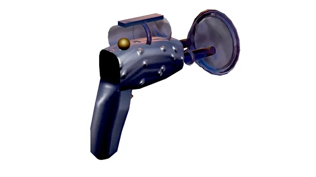</td>
<td width="50%"><b>2 · 執法者手槍</b><br>主要：穩定的單發即時命中。<br>次要：射速更快，但散佈更大。<br>中近距離可靠的出生武器。<br><br><b>主要射擊實戰</b><br><br><b>次要射擊實戰</b><br><br><b>360° 地面拾取展示</b><br>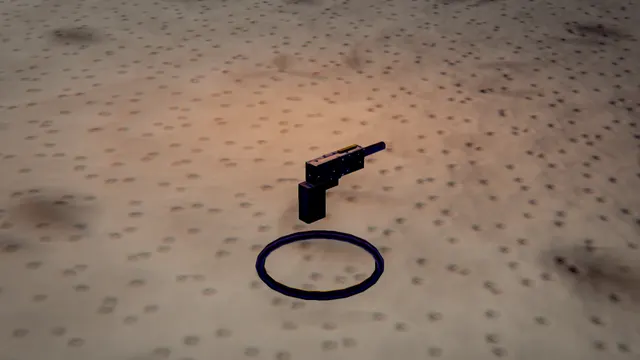</td>
</tr>
<tr>
<td><b>3 · 生化步槍</b><br>主要：連射會濺射的生化凝膠。<br>次要：按住蓄積大型高傷害凝膠。<br>用於封鎖門口、轉角與狹窄通道。<br><br><b>主要射擊實戰</b><br><br><b>次要射擊實戰</b><br><br><b>360° 地面拾取展示</b><br>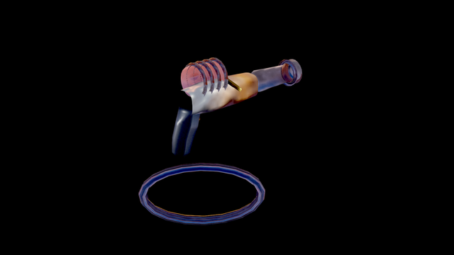</td>
<td><b>4 · 震盪步槍</b><br>主要：精準的遠距能量光束。<br>次要：發射較慢的震盪球。<br>用主要光束擊中自己的震盪球可引發震盪連鎖。<br><br><b>主要射擊實戰</b><br><br><b>次要射擊實戰</b><br><br><b>360° 地面拾取展示</b><br>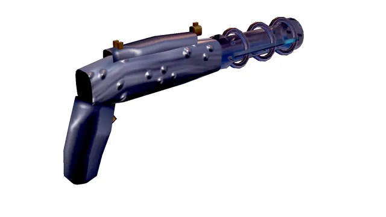</td>
</tr>
<tr>
<td><b>5 · 脈衝步槍</b><br>主要：高速連射電漿彈。<br>次要：近距離持續能量束。<br>追蹤走位中的敵人時尤其有效。<br><br><b>主要射擊實戰</b><br><br><b>次要射擊實戰</b><br><br><b>360° 地面拾取展示</b><br>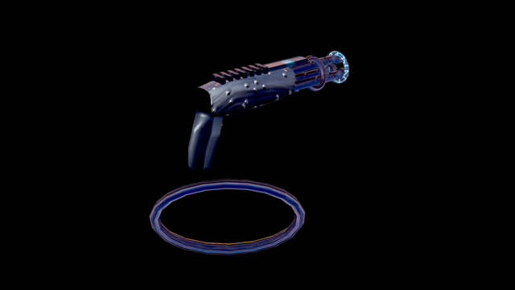</td>
<td><b>6 · 撕裂者</b><br>主要：發射可在牆面反彈的刀刃。<br>次要：發射具有爆炸範圍的刀刃。<br>可利用轉角與反彈路線打擊掩體後方。<br><br><b>主要射擊實戰</b><br><br><b>次要射擊實戰</b><br><br><b>360° 地面拾取展示</b><br>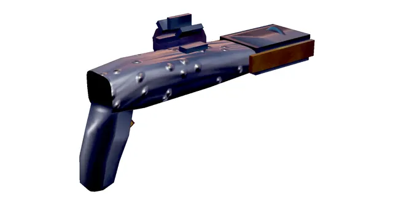</td>
</tr>
<tr>
<td><b>7 · 速射機槍</b><br>主要：較精準的高速連射。<br>次要：極高射速、較大散佈。<br>持續壓制中近距離目標。<br><br><b>主要射擊實戰</b><br><br><b>次要射擊實戰</b><br><br><b>360° 地面拾取展示</b><br>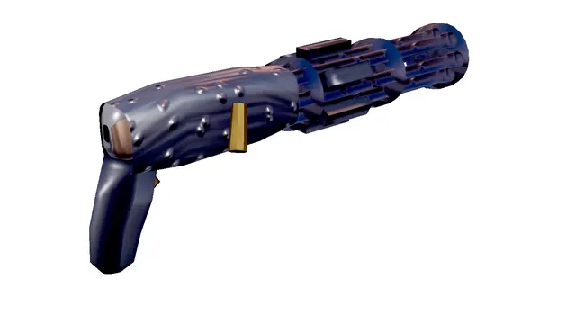</td>
<td><b>8 · 破片加農砲</b><br>主要：一次散射九枚高速破片。<br>次要：拋射會爆炸的破片砲彈。<br>近距離正面命中具有極強爆發力。<br><br><b>主要射擊實戰</b><br><br><b>次要射擊實戰</b><br><br><b>360° 地面拾取展示</b><br>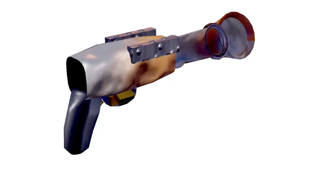</td>
</tr>
<tr>
<td><b>9 · 火箭發射器</b><br>主要：直線飛行的高傷害火箭。<br>次要：受重力影響、可越過障礙的榴彈。<br>瞄準敵人腳下，以爆炸範圍封鎖退路。<br><br><b>主要射擊實戰</b><br><br><b>次要射擊實戰</b><br><br><b>360° 地面拾取展示</b><br>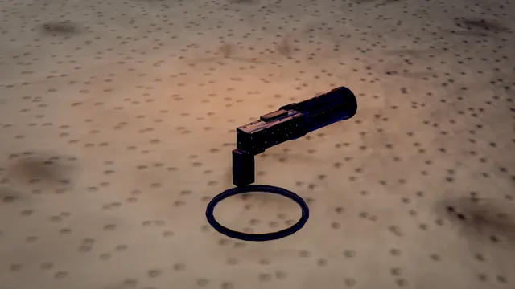</td>
<td><b>狙擊步槍</b><br>主要：高傷害、零散佈的遠距射擊。<br>次要：啟用放大瞄準。<br>制高點與跨場通道上的首選。<br><br><b>主要射擊實戰</b><br><br><b>次要射擊實戰</b><br><br><b>360° 地面拾取展示</b><br>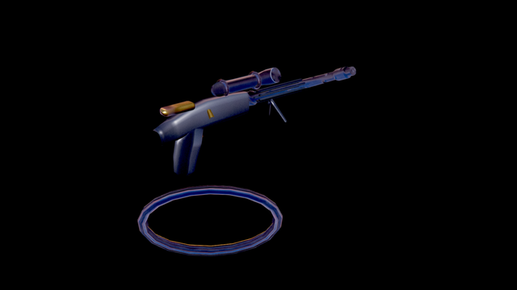</td>
</tr>
<tr>
<td><b>0 · 救世主核彈</b><br>主要：發射大範圍核彈頭。<br>次要：速度較慢，但爆炸半徑與傷害更高。<br>極稀有；發射前先確認自己有安全距離。<br><br><b>主要射擊實戰</b><br><br><b>次要射擊實戰</b><br><br><b>360° 地面拾取展示</b><br>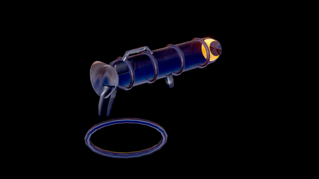</td>
<td><br><b>切換提示</b><br>數字鍵 1～9 選擇衝擊錘至火箭發射器，0 選擇救世主；Q／E 或滑鼠滾輪循環切換。狙擊步槍可用循環切換或自行綁定快捷鍵。</td>
</tr>
</table>

圖庫可由 [`docs/capture-weapons.ps1`](docs/capture-weapons.ps1) 重新擷取；腳本會為每把武器產生
主要／次要射擊的 30 格循環 WebP 與 36 格 360° 地面拾取展示，並在輸出後驗證動畫格數與尺寸。流程使用實際
關卡、武器模擬和電腦控制器，確保文件展示的永遠是目前引擎實際執行的戰鬥效果。實戰動畫與
旋轉展示的完整環境、取景方式、局部重建、畫面驗收與版本控制程序見
[`docs/weapon-footage-capture.md`](docs/weapon-footage-capture.md)。

---

## 多滑鼠．獨立按鍵配置

同機分割畫面最大的難題是：GLFW（以及絕大多數視窗框架）會把所有滑鼠合併成單一系統游標，
因此多位玩家會共用同一個準心。本專案改用 **Windows Raw Input**：

* 掛接遊戲視窗的視窗程序，攔截 `WM_INPUT`，讓每個 HID 裝置的位移、按鍵與滾輪各自獨立。
* 每位玩家綁定自己的滑鼠代號；玩家二、三有自己的滑鼠時，視角、按鍵與滾輪只送往對應玩家，
  因此可用第二或第三個滑鼠的滾輪切換武器，操作完全互不干擾。
* 若指派了各自的實體鍵盤，按鍵也會依裝置分流，多位玩家可以同時使用相同且順手的配置。
* 任何環節不可用時（非 Windows、驅動異常）都會自動退回共用滑鼠模式，遊戲仍可正常執行。

Windows 通常會列舉十幾個「幽靈」HID 裝置，因此配對採用**實際輸入偵測**而非列舉順序：
在「輸入裝置指派」畫面裡晃動每一個滑鼠，系統就會依序把真正在使用的裝置指派給各位玩家。
也可以逐一手動指派。

### 預設按鍵配置

| 操作 | 玩家一 | 玩家二 | 玩家三 |
| --- | --- | --- | --- |
| 移動 | `W` `A` `S` `D` | 方向鍵 | `Y` `G` `H` `J` |
| 視角 | 第一個滑鼠 | 第二個滑鼠 | 第三個滑鼠 |
| 開火／次要開火 | 滑鼠左鍵／右鍵 | 滑鼠左鍵／右鍵 | 滑鼠左鍵／右鍵 |
| 跳躍／蹲下 | `Space` / 左 `Ctrl` | 右 `Shift` / 右 `Ctrl` | `M` / `N` |
| 切換武器 | `E` `Q` / 滾輪 | 上一頁／下一頁 / 第二個滑鼠滾輪 | `U` / `T` / 第三個滑鼠滾輪 |
| 武器快捷 | 數字鍵 `1`～`0` | 可自行指定 | 可自行指定 |
| 計分板 | `Tab` | `Delete` | `B` |

閃避一律為**連按兩次方向鍵**。

沒有專屬滑鼠時，該欄位會優先使用可用手把；玩家二的純鍵盤備援會以數字鍵盤 `4` `6` `8` `5`
轉動視角、`0` 開火、`.` 次要開火，
並停用滑鼠視角，避免跟著玩家一的游標一起轉動。若接上手把，玩家二～四也可直接使用手把
（左類比移動、右類比視角、`RT`/`RB` 開火、`A` 跳躍、按下左類比閃避）。

所有動作都可在「輸入裝置與按鍵 → 編輯按鍵配置」中重新指定。

雙人對戰的「對戰設定」另有「雙人分割方向」選項，可選擇水平的上下畫面或垂直的左右畫面；
選擇會和其他對戰設定一起保存。三至四人模式固定使用四象限配置。

### 通用按鍵

`Esc` 暫停選單　　`F3` 效能資訊　　`F5` 快速儲存　　`F9` 快速載入　　`F11` 切換全螢幕　　`F12`／`Print Screen` 螢幕截圖

全螢幕下不依賴 Windows 的桌面擷取；遊戲會先把完整畫面合成到自己的 OpenGL 色彩緩衝，`F12`
與 `Print Screen` 再從該緩衝存成 `%APPDATA%\Unreal99\screenshots\` 內的 PNG，並把同一張圖片放入
Windows 剪貼簿，因此貼到小畫家、聊天軟體或文件時不會得到空白圖片。

---

## 設定與存檔

所有設定與存檔都寫在 `%APPDATA%\Unreal99\`：

```
%APPDATA%\Unreal99\
  settings.json     畫質、輸入、裝置指派、上次的對戰設定、隊伍與個別電腦難度
  screenshots\*.png F12／Print Screen 擷取的全螢幕或視窗畫面
  saves\slot0.json  存檔內容
  saves\slot0.png   存檔當下的預覽畫面
```

寫入一律先寫暫存檔再置換，中途斷電只會留下前一份完整的檔案，不會出現寫到一半的設定檔。
設定放在漫遊設定檔而非執行檔旁邊：安裝目錄經常唯讀，而封裝式應用程式在執行檔旁的寫入會被
系統重新導向到使用者永遠找不到的地方。

### 設定持久化

畫質、解析度比例、各項後製開關、視野、滑鼠靈敏度、Y 軸反轉、垂直同步、音量，以及**四位玩家
各自的完整按鍵配置**都會自動保存，下次啟動即還原。裝置指派記錄的是**裝置名稱而非 Raw Input
代號**——代號每次開機都會重新分配，存下來只會把玩家綁到剛好接手該編號的裝置上。

上一次使用的對戰設定（競技場、模式、本機人數、雙人分割方向、電腦數量與全域難度、示範模式與代打難度、
擊殺／奪旗／時間上限及重生等待時間）也會一併記住。重生等待時間可在開戰前設定為 0 至 9 秒，
預設為 3 秒；0 秒代表死亡後立即重生。每位玩家的名稱與隊伍、每名電腦的隊伍與個別難度覆寫
同樣會跨工作階段保存。
選單中的每次調整都會標記為待寫入，實際寫檔延後 0.75 秒——按著方向鍵調整滑桿時，
不該每一格就重寫一次檔案。離開遊戲前會強制寫出尚未落地的變更。

自動測試可設定 `UNREAL99_USERDATA`，把設定與存檔導向獨立目錄，避免碰觸實際玩家資料；未設定時
仍使用上方的 `%APPDATA%\Unreal99\`。

### 隊伍與個別電腦難度

「對戰設定」會列出每位本機玩家的名稱。團隊死亡競賽與奪旗大戰還可把每位玩家及每名電腦
分別設為「自動」、「紅隊」或「藍隊」；自動分配會在尊重已指定隊伍的前提下平衡人數。
每名電腦亦可選擇「跟隨全域」，或獨立覆寫為新手至神級的任一難度。

### 存檔與讀檔

對戰中隨時可以 `F5` 快速儲存、`F9` 快速載入，或從暫停選單進入「儲存進度／載入進度」選擇
六個存檔位之一。存檔會記下完整戰況：

* 每個角色的位置、速度、視角、生命、裝甲、持有武器與彈藥、當前武器、增益狀態與計分
* 每件道具是否已被撿走，以及各自的重生倒數
* 比賽時鐘、重生等待時間、隊伍分數、最後生還者的剩餘生命、奪旗模式的旗幟位置與持有者
* 電腦對手的亂數種子——重新載入後還是同一個對手，不是換了個名字的新人

存檔位挑選畫面會顯示**儲存當下的遊戲畫面縮圖**，以及該場對戰的完整設定：競技場、模式、
本機人數、電腦數量與難度、擊殺／奪旗與時間上限、已進行時間與當前領先者。只靠一排時間戳
是分不出哪一個存檔是哪一場的。

載入完成後會有**三秒倒數**才真正接手。倒數期間整個世界靜止——沒有人移動、開火、重生或流血，
比賽時鐘也不走——只有畫面照常繪製。存檔多半是在交火中按下的，直接恢復等於還沒看清楚畫面
就已經被打中了。倒數數字每一格都畫在畫面上，而非只在報數的那一瞬間閃現。

### 示範模式

對戰設定中可開啟「示範模式」，由電腦接手所有本機玩家，分割畫面與 HUD 照常運作。
代打電腦的程度是**獨立設定**的，與對手難度分開——可以讓一個神級代打穿越地圖，同時把所有
對手設為新手。`--demo` 與 `--demoskill` 命令列參數可提供相同設定。

### 選單操作

所有選單畫面（主選單、對戰設定、畫面設定、操作說明、輸入裝置、按鍵配置、暫停與戰績）
都同時支援鍵盤、手把與滑鼠：

| 操作 | 方式 |
| --- | --- |
| 移動選擇 | 滑鼠移動即可高亮，或使用 ▲▼ / 手把方向鍵 |
| 執行項目 | 滑鼠左鍵、Enter，或手把 A |
| 調整數值 | 點擊顯示值左側即可減少、點擊顯示值或其右側即可增加；右鍵減少；或使用 ←→ 方向鍵 |
| 捲動長清單 | 滑鼠滾輪，或以方向鍵移動選擇 |
| 返回 | Esc 或手把 B |

競技場以視覺化圖庫呈現；滑鼠移到或以方向鍵反白卡片時，下方會立即顯示該地圖的介紹與模式相容性。
裝置指派與按鍵綁定提示也有可點擊的「取消」按鈕，滑鼠右鍵亦可取消。

游標由遊戲自行繪製（系統游標在全螢幕下並不可靠），且只在滑鼠實際移動後才會出現，
因此純鍵盤操作時不會有游標擋在畫面上。

對戰期間 HUD 會持續顯示目前的**模式與競技場名稱**。畫面中的角色會以隊伍色標示玩家名稱及
生命條；奪旗大戰的持旗者另有旗幟標記。本機玩家造成與承受的實際生命／裝甲傷害會以向上飄散、
逐漸淡出的數字分開顯示。下方武器欄由遊戲在啟動時直接用目前的 3D 武器模型與材質算繪縮圖，
並列出每把已持有武器的剩餘彈藥及該玩家已設定的直接選取按鍵；目前武器以亮框標示，沒有另一套
可能過期的預先產生縮圖。垂直雙人與四人分割畫面會把縮窄的生命／裝甲卡、武器縮圖列及目前武器
卡排在同一個最下方區帶；紅、藍旗幟狀態分居左右並與下方側卡同寬，控制點狀態緊貼其上，
不會互相遮住或占用畫面中央。「你的隊伍」固定在各玩家視窗的右上角。所有遊戲介面
文字的設計尺寸至少為 12 px，重要狀態與操作提示會使用更大的字級。

---

## 專案結構

```
src/Unreal99/
  Assets/       ImageGen 品牌標誌與衍生應用程式圖示
  Core/         數學（GL 慣例矩陣）、亂數
  Platform/     輸入系統、Raw Input、按鍵配置、PNG／ICO 輸出、開始選單捷徑
  Rendering/    OpenGL 封裝、著色器、算圖器、粒子、字型、2D 介面
  World/        碰撞筆刷、導航圖、關卡建構器、二十五座競技場
  Game/         角色移動、武器、投射物、道具、電腦 AI、遊戲模式、模擬
  Audio/        程序化合成 + OpenAL 3D 播放
  UI/           繁體中文字串表、HUD、選單
  App.cs        視窗、分割畫面、前端狀態機
src/Unreal99.Installer/
  InstallerForm.cs  圖形化安裝介面
  InstallService.cs 共用的 GUI／CLI 安裝與移除引擎
```

### 繪圖

以 **OpenGL 3.3 core** 為目標的前向算圖器，可在內建顯示晶片上執行。

* **PBR** — Cook-Torrance GGX、金屬度／粗糙度、半球環境光，並用小型立方體貼圖提供鏡面環境反射。
* **太陽陰影** — 單張對齊像素格的正交陰影貼圖，3×3 PCF；每畫格只算一次，所有分割畫面共用。
* **動態點光源** — 每個視角最多 20 盞，依距離與強度評分挑選。衰減經過正規化，`intensity`
  的意義是「在半徑四分之一處的亮度」，讓調整光源變得直覺。
* **MRT** — HDR 色彩加上視空間法線緩衝，供 SSAO 使用。
* **後製** — SSAO、泛光與變形鏡頭光斑、體積光束、ACES 色調映射、調色、暗角、色差、底片顆粒與 FXAA。
* **第一人稱武器** — 以獨立的窄視野投影繪製，並壓縮到深度緩衝最前緣，因此永遠不會穿牆，
  在任何視野角度下大小都正常。
* **程序化天空** — 漸層、飄動雲層、閃爍星空與太陽。

矩陣一律使用 `System.Numerics` 的列向量慣例，並且不轉置直接上傳；由於 GLSL 以行主序讀取這
16 個浮點數，著色器收到的正好是它需要的行向量形式。投影矩陣則是手寫的，對應 OpenGL 的
`[-1,1]` 深度範圍，而非 .NET 內建的 `[0,1]` DirectX 範圍。

### 效能

分割畫面會讓每一道全螢幕運算成倍增加，因此畫質會自動調整：超過兩個視角時關閉 SSAO、
超過一個視角時關閉體積光束、三個以上視角時陰影貼圖減半。另有動態解析度控制器，
在畫格時間拉長時降低內部解析度，有餘裕時再調回來。

在 Intel HD Graphics 520、1600×900、「高」畫質下實測：

| 設定 | 每秒畫格 |
| --- | --- |
| 1 位玩家 + 9 個電腦 | 約 47 |
| 2 位玩家 + 8 個電腦 | 約 44 |
| 4 位玩家 + 6 個電腦 | 約 55 |

### 程序化內容

* **材質** — 以可平鋪的 value／ridged／Worley 雜訊合成 18 種材質，各自產生一張反照率貼圖
  （alpha 為自發光遮罩）與一張法線貼圖（alpha 為粗糙度），法線由高度場以 Sobel 推導。
* **角色** — 19 根骨骼的人形骨架；網格由錐化基本體組成，並依到骨段的距離自動計算蒙皮權重。
  奔跑、跳躍、落地、蹲伏、開火、閃避、死亡等所有動作皆以解析式計算，不使用關鍵影格。
* **武器** — 十一把全部以程式建模，統一以 -Z 為前方的區域座標系，因此同一份網格可同時用於
  第一人稱視角、第三人稱持槍與道具展示台。
* **競技場** — 二十五座場地全部透過 `LevelBuilder` 撰寫，同時產生算圖幾何與碰撞筆刷。圓形結構
  會柵格化成軸對齊區塊，確保碰撞與可見表面完全一致。路徑點圖在關卡建好後自動生成，
  因此新增競技場不需要另外標註導航資料。
* **音效** — 所有音效在啟動時合成為 PCM 緩衝（濾波雜訊爆發、掃頻正弦、加法式鐘聲），
  再透過 OpenAL 以 3D 定位播放。

### 遊戲性

移動手感重現 1999 年的原作：極高的地面加速度、充裕的空中操控、連點閃避，
以及相對於奔跑速度偏低的重力。

十一把武器全部實作了主要與次要射擊，包含**震盪連鎖**（用主要光束引爆自己發射的震盪球）、
會彈跳的破片、會反彈並斬首的撕裂者飛刃、可蓄力並黏附表面的生化黏球，以及救世主核彈。

電腦對手會在由碰撞世界自動產生的路徑點圖上規劃路線，再進行本地轉向。難度會影響反應時間、
瞄準抖動、投射物提前量、移動速度、射擊節奏、傷害、閃避頻率與感知範圍。0～4 級採用較平緩的
學習曲線，最簡單級別有明顯的反應、移動與傷害限制；第 5 級保留原有強度。牠們會依交戰距離選擇武器、避免被自己的爆炸波及、
追擊失去視野的目標最後出現的位置、受傷時退往掩體，並在奪旗、支配佔領、攻堅與突擊模式中執行各自的目標；攻堅與突擊中還會判斷該不該去開載具，以及開到哪個距離停下來。投射物瞄準會解出
最早可達的攔截點，納入敵人的目前速度、方向、空中重力，以及武器本身的彈速、重力與向上發射速度；
神級使用完整解，較低難度則依級別保留刻意誤差。

不開啟視窗即可執行固定的瞄準物理回歸測試：

```powershell
dotnet src\Unreal99\bin\Release\net10.0\Unreal99.dll --aimtest
```

測試包含靜止、橫向奔跑、空中墜落、受重力彈道與不可達目標；全部通過時輸出 `AIM_TEST PASS`。

可用下列固定步長測試讓神級主角分別走遍全部二十五張地圖，並以新手對手維持低干擾環境。每張地圖都以自己被設計的模式測試，因此攻堅與突擊那四張同時也覆蓋了載具與目標的程式碼路徑：

```powershell
.\scripts\test-bot-traversal.ps1 -Frames 3600
```

測試不會鎖定、置中或移動桌面游標；每張地圖的移動距離、造訪區域、停滯／來回抖動、墜落死亡、
日誌及結尾截圖會寫入 `artifacts\bot-traversal\`，總表則輸出為 `results.json` 與 `summary.csv`。
完整的自動門檻、人工複核方式、失敗調查流程與新地圖強制驗收清單，請見
[電腦走圖測試與地圖驗收程序](docs/bot-traversal-validation.md)。**任何日後新增的地圖都必須登錄
到此測試、通過 3600 畫格單圖驗證，再通過完整全地圖回歸，才可視為完成。**

模式：死亡競賽、團隊死亡競賽、奪旗大戰、支配佔領、攻堅模式、突擊模式、最後生還者、瞬殺模式，並附有 UT 風格的連殺與多重擊殺
播報、一血、領先變化與延長賽。

---

## 說明

所有角色、武器模型、材質與音效皆為原創。本專案是同類型遊戲的獨立實作，並非移植，
不含原作的任何素材。

二十五座競技場的佈局向原作的經典地圖致敬（前二十一座出自 1999 年初代，另外四座出自 UT2004），但幾何、材質與道具配置都是重新設計並以程式
產生的——沒有反編譯、轉檔或複製任何原作關卡資料。地圖名稱為對應的中文命名，並在上表中標註
致敬對象。
